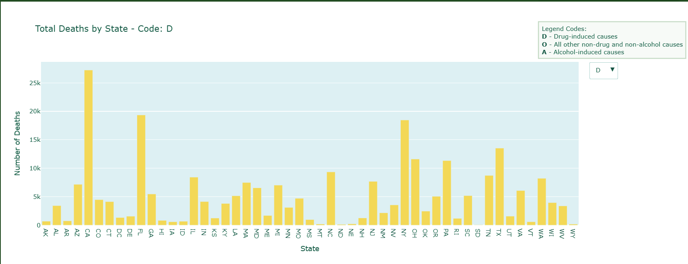

# Analyzing the Societal and Economic Impact of Drug Use in the U.S.

**By: Ayngaran Krishnamurthy**

---

## A Story of Numbers, People, and Policy

### Chapter 1: A Broader Lens

Picture this: a young adult in their 30s, once thriving in their career, begins to struggle silently with substance abuse. It's a tragedy — yes — but it's not just theirs. What begins as a personal crisis soon unravels a thread that connects to lost jobs, strained families, rising healthcare costs, and a shrinking economy.

> *"What is the true societal and economic impact of drug abuse in the United States?"*

This report is my attempt to answer that question. It’s a story told through data — but more importantly, it’s about understanding how interconnected our social health and economic wellbeing really are.

---

## Chapter 2: Building the Framework

### Why This Study Matters
We know substance abuse affects individuals. But what about our communities, our labor force, or national productivity? This study aims to bridge that gap — to translate isolated tragedies into a broader narrative of societal cost and lost potential.

### What We Focused On
- Drug and alcohol-related deaths
- Unemployment patterns
- Gross Domestic Product (GDP)
- How these forces interact with one another

### Tools of the Trade
The project was built using:
- **Google Colab** for analysis
- **Pandas**, **Matplotlib**, and **Plotly** for visualizations

### Our Data Sources
- **CDC** – Multiple Cause of Deaths
- **USDA** – Unemployment & Income
- **BEA** – GDP & Personal Income
- Peer-reviewed research from the **National Library of Medicine**, **BMC Psychiatry**, and **Evoke Wellness**

---

## Chapter 3: The Guiding Questions

Our exploration was led by three key questions:

1. How do drug-induced deaths compare to other major causes?
2. Is there a relationship between substance abuse and unemployment?
3. What role does drug use play in shaping the broader economy, particularly GDP?

---

## Chapter 4: The Growing Toll of Drug-Related Deaths

When we examined the CDC dataset, a concerning trend emerged:

- **Drug-related deaths now often surpass alcohol-related deaths** across U.S. states.
- The **most affected age group** is between 25 and 49 — the prime working-age population.
- The timeline from **2018 to 2023** reveals a **steady increase** in such deaths.

### Visual Highlights:
- **Figure 1.1**: Drug deaths by state  
  
  [Explore the Interactive Chart](https://polite-seahorse.static.domains/interactive-chart-11)

- **Figure 1.3**: Alcohol deaths by state  
  
  [Explore the Interactive Chart](https://polite-seahorse.static.domains/interactive-chart-11)

- **Figure 1.4**: Drug deaths by age  
  
  [Explore the Interactive Chart](https://polite-seahorse.static.domains/interactive-chart-12)

- **Figure 1.5**: Drug deaths over time  
  
  [Explore the Interactive Chart](https://polite-seahorse.static.domains/interactive-chart-13)

### What This Tells Us
Drug-related mortality is not just growing — it’s shifting toward our most economically productive citizens. This isn’t just tragic — it’s economically unsustainable.

---

## Chapter 5: When Drug Use Meets Unemployment

Substance abuse and unemployment don’t just co-exist — they often **feed each other**.

Major events like:
- The **2008 recession**, and
- The **COVID-19 pandemic**

…brought spikes in unemployment. But data suggests states with **higher drug deaths also face more unemployment.**

### Visual Highlights:
- **Figure 2.3**: Drug deaths vs. unemployment rate  
  
  [Explore the Interactive Chart](https://polite-seahorse.static.domains/interactive-chart-23)

- **Figure 2.4**: Drug deaths vs. total unemployed population  
  
  [Explore the Interactive Chart](https://polite-seahorse.static.domains/interactive-chart-24)

### What This Tells Us
There’s a **strong correlation** between substance abuse and unemployment — especially when we look at the absolute number of unemployed people. This implies a deeper, structural issue where addiction prevents re-entry into the workforce.

---

## Chapter 6: The Ripple Effect on GDP

Now let’s look at how these societal issues tie into the backbone of economic health — the **Gross Domestic Product**.

Key observations:
- GDP **dropped sharply in 2008** and again in **2020**.
- These drops align with high unemployment and, indirectly, with substance abuse spikes.

### Visual Highlight:
- **Figure 3.4**: GDP vs. Unemployment Count  
  
  [Explore the Interactive Chart](https://polite-seahorse.static.domains/interactive-chart-34)

### What This Tells Us
GDP and unemployment are **inversely proportional**. When unemployment rises — often fueled by drug-related issues — **GDP takes a hit**. This highlights the economic cost of addiction at a national scale.

---

## Chapter 7: Answering the Big Three

Let’s revisit our initial questions:

1. **Are drug deaths rising?**
   Yes — and they now **rival or exceed alcohol deaths** in many states.

2. **Is there a link between drug use and unemployment?**
   Absolutely — the correlation is visible both in percentages and raw numbers.

3. **Does this impact GDP?**
   Yes — indirectly but powerfully, through reduced workforce participation and increased unemployment.

---

## Chapter 8: Where We Go From Here

The personal crisis of addiction quickly escalates into a **collective burden**. This project reveals that drug abuse is:

- A **public health emergency**
- A **drag on employment and productivity**
- A **threat to economic stability**

By addressing substance abuse, we’re not just saving lives — we’re **protecting livelihoods** and **preserving economic resilience**.

---

## References
- National Library of Medicine: [PMC Article](https://pmc.ncbi.nlm.nih.gov/articles/PMC10137824/)
- BMC Psychiatry: [Substance Abuse and Unemployment](https://bmcpsychiatry.biomedcentral.com/articles/10.1186/s12888-020-02981-7)
- Evoke Wellness: [Unemployment and Drug Abuse](https://www.evokecoconutcreek.com/blog/unemployment-and-drug-abuse/)
- CDC: [Multiple Cause of Deaths Dataset](https://wonder.cdc.gov/wonder/help/mcd-expanded.html)
- USDA: [Unemployment and Income Data](https://www.ers.usda.gov/data-products/county-level-data-sets/county-level-data-sets-download-data)
- BEA: [GDP and Personal Income](https://apps.bea.gov/itable)
- Plotly: [Python Graphing Library](https://plotly.com/python/getting-started/)

---

*Prepared and compiled as part of CS 625 Data Visualization Coursework by Ayngaran Krishnamurthy.*
